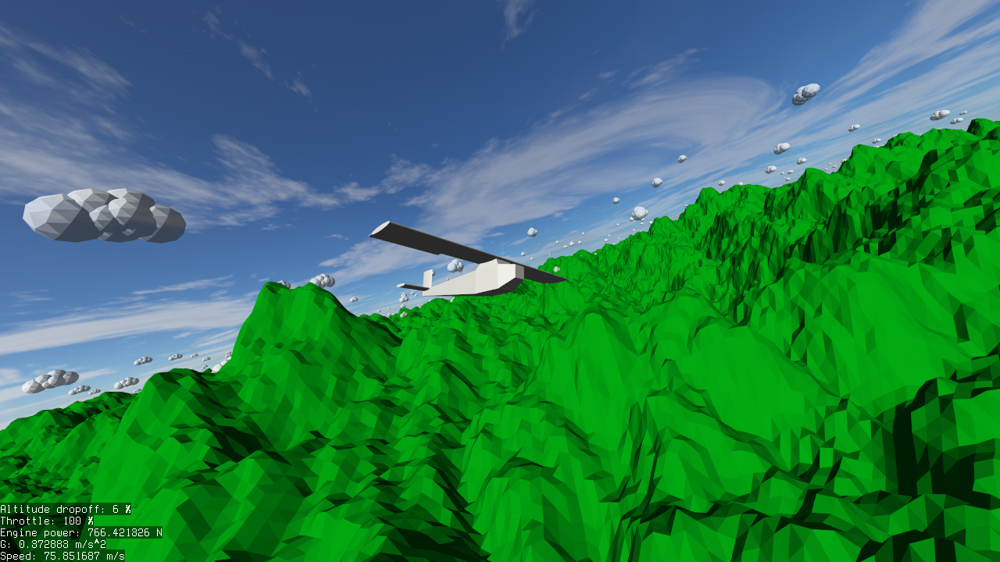
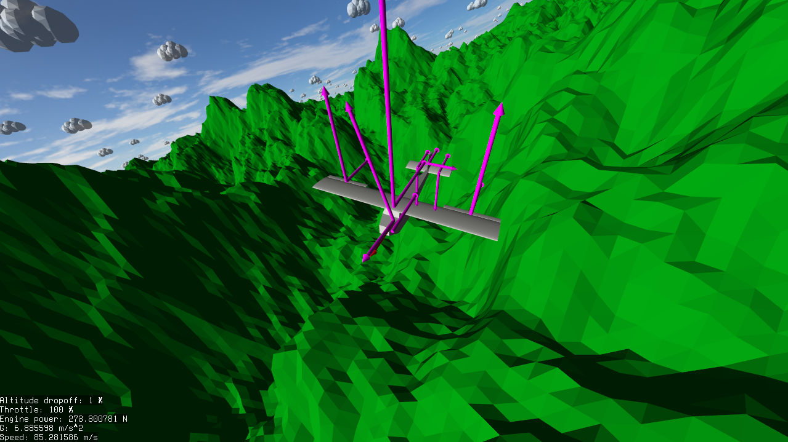

# FY1412-flightsim
Flight simulator for course in physics for games. 
Correct moment of inertia is calculated through a voxelization-like process. 
The plane is "rendered" towards the wind so air drag can better be estimated.
## Screenshots

